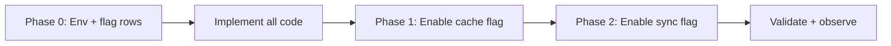
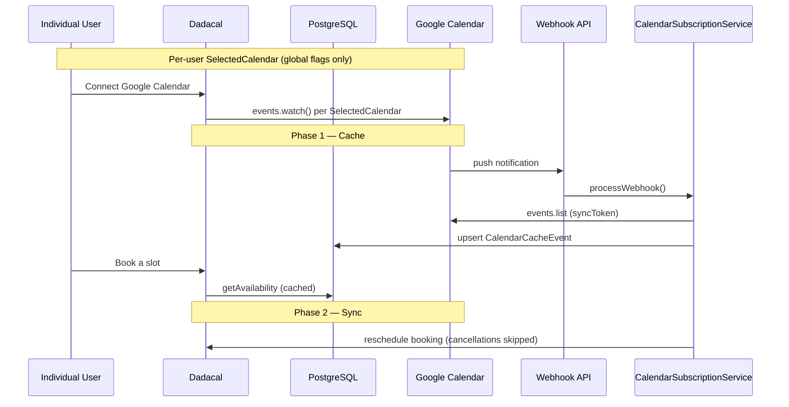

# Google Calendar Two-Way Sync — Implementation Plan

> **Scope:** Enable Google Calendar → Dadacal sync for **time change (reschedule)** only.  
> Dadacal → Google already works via the existing booking/calendar pipeline.  
> **Out of scope:** cancel from Google, title, description, location, duration, and attendee/RSVP changes.  
> (Cancellations must be done in Dadacal so booking/attendee workflows stay intact.)

> **Rollout order:** Ship **all code changes in one go** → enable **cache** → enable **sync**.  
> **Dadacal constraint:** No teams, no `UserFeatures` gating. Global flag ON = all users.

---

## Background

Today, calendar integration is mostly **one-way**:

| Direction | Status |
|-----------|--------|
| **Dadacal → Google** | Works — bookings create/update/delete Google Calendar events via `EventManager` |
| **Google → Dadacal** | Partially built, disabled by default, and broken for Dadacal branding |

Cal.com already ships a `calendar-subscription` system (Google push notifications, webhook endpoint, Postgres cache, inbound sync). The upstream design assumes **multi-team SaaS rollout** with optional per-user feature assignment. Dadacal must **remove team and `UserFeatures` coupling** and gate everything on **global flags only**.

---

## Rollout Strategy



| Phase | What | Code? |
|-------|------|-------|
| **0** | Environment variables + feature flag rows in DB | No |
| **Code** | All implementation in one change set (see below) | **Yes — single delivery** |
| **1** | Flip `calendar-subscription-cache` ON | No |
| **2** | Flip `calendar-subscription-sync` ON | No |
| **Validate** | Smoke tests + observability | Tests included in code delivery |

---

## Dadacal Model: Global Flags Only

Upstream Cal.com gates cache/sync through **teams** and optionally **UserFeatures**. Dadacal does neither.

| Upstream behavior | Dadacal replacement |
|-------------------|---------------------|
| Cron subscribes only users on teams with cache enabled | Cron subscribes **any** `SelectedCalendar` with a valid Google credential |
| Cache read/write checks team membership or `UserFeatures` | Global cache flag ON → **all users** |
| Sync is global but cron won't run without cache + teams | Cron runs when **cache OR sync** is globally enabled |
| `TeamFeatures` / `UserFeatures` | **Not used** for calendar-subscription |

### Target gating model

```
Global flag OFF  →  feature disabled for everyone
Global flag ON   →  all users with connected Google calendars get the feature
```

No `UserFeatures` rows. No `TeamFeatures`. No team membership checks.

---

## Where Cache Is Stored

**PostgreSQL — not Redis.**

| Table | Role |
|-------|------|
| **`CalendarCacheEvent`** | Current system — one row per busy Google event per watched `SelectedCalendar` |
| **`CalendarCache`** | Legacy URL-keyed JSON — **not** used by subscription cache |

Stale rows (past `end`) are purged daily by `/api/cron/calendar-subscriptions-cleanup`.

---

## What Already Exists

### Outbound (Dadacal → Google)

```
Booking create / reschedule / cancel
  → EventManager → CalendarManager → GoogleCalendarService
  → Google Calendar API
  → BookingReference (Google event ID)
```

### Inbound pipeline (shared by cache + sync)

```
Google Calendar change
  → POST /api/webhooks/calendar-subscription/google_calendar
  → CalendarSubscriptionService.processWebhook()
  → fetchEvents() via syncToken
  → CalendarCacheEventService.handleEvents()   ← cache
  → CalendarSyncService.handleEvents()         ← sync
```

---

## Implementation (Single Change Set)

Ship everything below together. No PR split.

### 1. Remove team + UserFeatures gating

**Files:**
- `packages/features/calendar-subscription/lib/CalendarSubscriptionService.ts`
- `packages/features/selectedCalendar/repositories/SelectedCalendarRepository.ts`
- `packages/features/selectedCalendar/repositories/SelectedCalendarRepository.interface.ts`
- `packages/app-store/_utils/getCalendar.ts`
- Cron/webhook instantiation sites
- Related unit tests + README

| Change | Before | After |
|--------|--------|-------|
| Cron entry condition | Returns early unless cache globally enabled | Run when **cache OR sync** globally enabled |
| Team lookup | `getTeamsWithFeatureEnabled(cache)` → `teamIds` | **Remove** — stop calling `teamFeatureRepository` |
| Batch query | Filters by team membership | Any eligible `SelectedCalendar` (credential present) |
| `isCacheEnabledForUser()` | Checks `UserFeatures` / team inheritance | Return `true` whenever global cache is ON (or remove the per-user check entirely) |
| `getCalendar()` slot mode | `checkIfUserHasFeatureNonHierarchical()` | Use global cache flag only |

```typescript
// Target cron shape (pseudocode)
async checkForNewSubscriptions() {
  const [cacheEnabled, syncEnabled] = await Promise.all([
    this.isCacheEnabled(),
    this.isSyncEnabled(),
  ]);
  if (!cacheEnabled && !syncEnabled) return;

  const rows = await this.deps.selectedCalendarRepository.findNextSubscriptionBatch({
    take: 100,
    integrations: this.deps.adapterFactory.getProviders(),
    genericCalendarSuffixes: this.deps.adapterFactory.getGenericCalendarSuffixes(),
    // no teamIds
  });
  // ...
}

// Target cache access: global flag only
async isCacheEnabledForUser(_userId: number): Promise<boolean> {
  return this.isCacheEnabled();
}
```

Also remove `teamFeatureRepository` / unused `userFeatureRepository` wiring from calendar-subscription constructors if no longer needed.

### 2. Fix inbound sync matching for Dadacal

**File:** `packages/features/calendar-subscription/lib/sync/CalendarSyncService.ts`

| Change | Details |
|--------|---------|
| Fix `iCalUID` matching | Match `@{APP_NAME}` (case-insensitive), not hardcoded `@cal.com` |
| Fallback via `BookingReference` | Match Google `event.id` to `BookingReference.uid` when `iCalUID` is missing/mismatched |
| Pass host `userId` | Set `userId: booking.userId` in `bookingMeta` so minimum reschedule notice treats host as organizer |

### 3. Add `skipBookingWindowCheck`

**No existing flag** skips booking window validation. `validateBookingTimeIsNotOutOfBounds` always runs today and enforces `periodDays` / `minimumBookingNotice`.

| File | Change |
|------|--------|
| `packages/features/bookings/lib/dto/types.d.ts` | Add `skipBookingWindowCheck?: boolean` to `PlatformParams` |
| `packages/features/bookings/lib/service/RegularBookingService.ts` | Wrap `validateBookingTimeIsNotOutOfBounds` in `if (!skipBookingWindowCheck)` |
| `CalendarSyncService.ts` | Pass `skipBookingWindowCheck: true` with existing skip flags |
| Booking flag + sync tests | Cover the new flag |

**Target `CalendarSyncService` bookingMeta:**

```typescript
bookingMeta: {
  userId: booking.userId ?? undefined,
  skipCalendarSyncTaskCreation: true,
  skipAvailabilityCheck: true,
  skipEventLimitsCheck: true,
  skipBookingWindowCheck: true, // periodDays + minimumBookingNotice
  impersonatedByUserUuid: null,
},
```

### 4. Destination calendar subscription guarantee

Ensure the calendar where bookings are **written** (`DestinationCalendar`) also has a `SelectedCalendar` row so Google watch channels cover it. Implement in Google connect callback and/or destination-calendar setup path.

### 5. Tests

- Unit/integration coverage for: team-filter removal, global-only cache gating, iCalUID/`BookingReference` matching, `skipBookingWindowCheck`, sync reschedule (cancelled events ignored)
- Smoke scenarios listed under Phase 1 / Phase 2 checklists

---

## Cache vs Sync (after code lands)

| | **Cache** | **Sync** |
|---|---|---|
| Flag | `calendar-subscription-cache` (**global only**) | `calendar-subscription-sync` (**global only**) |
| Purpose | Faster availability checks | Google reschedule → Dadacal booking |
| Team / UserFeatures | **None** | **None** |
| User gating | Global ON → all users | Global ON → all users |
| Extra code beyond gating | None | iCalUID fix + booking-window skip |

Both share the same Google watch channels and webhook endpoint.

---

## Limit Enforcement on Google Sync

When a host reschedules in **Dadacal**, the full booking flow applies all event-type limits. When Google sync applies a reschedule, skip flags bypass host-side limits.

| Limit | Dadacal reschedule | Google sync (after change) |
|-------|--------------------|----------------------------|
| Max bookings per day/week | Enforced | Skipped (`skipEventLimitsCheck`) |
| Duration limits | Enforced | Skipped |
| Calendar conflicts / availability | Enforced | Skipped (`skipAvailabilityCheck`) |
| Booking window (`periodDays`) | Enforced | Skipped (`skipBookingWindowCheck`) |
| Minimum booking notice | Enforced | Skipped (`skipBookingWindowCheck`) |
| Minimum reschedule notice | Host exempt | Host exempt via `userId` in `bookingMeta` |

**New bookings are unaffected** — skip flags are only used by calendar sync. Bookers still hit full validation.

---

## Gaps Addressed by the Code Change

| # | Gap |
|---|-----|
| 1 | Subscription cron requires team membership |
| 2 | Cache checks require `UserFeatures` / team inheritance |
| 3 | Hardcoded `@cal.com` in `CalendarSyncService` |
| 4 | No `skipBookingWindowCheck` for `periodDays` / `minimumBookingNotice` |
| 5 | Minimum reschedule notice can block sync (missing host `userId`) |
| 6 | Destination calendar may not be watched |

Env/flag enablement remains operational (Phases 0–2).

---

## Enablement Plan

### Phase 0 — Environment (before or with deploy)

1. **Environment variables:**
   - `GOOGLE_WEBHOOK_TOKEN`
   - `NEXT_PUBLIC_WEBAPP_URL` (or `GOOGLE_WEBHOOK_URL` for local dev)
   - `NEXT_PUBLIC_APP_NAME=Dadacal`

2. **Crons running** (`apps/web/vercel.json`):
   - `/api/cron/calendar-subscriptions` — every 5 min
   - `/api/cron/calendar-subscriptions-cleanup` — daily 03:00 UTC

3. **Feature rows in DB:**
   ```sql
   INSERT INTO "Feature" ("slug", "enabled", "description", "type", "stale", "createdAt", "updatedAt")
   VALUES
     ('calendar-subscription-cache', false, 'Calendar availability cache.', 'OPERATIONAL', false, NOW(), NOW()),
     ('calendar-subscription-sync', false, 'Calendar two-way sync.', 'OPERATIONAL', false, NOW(), NOW())
   ON CONFLICT (slug) DO NOTHING;
   ```

---

### Phase 1 — Enable cache (after code deployed)

**Goal:** Google events cached in Postgres; slot checks read local data.

```sql
UPDATE "Feature" SET "enabled" = true WHERE "slug" = 'calendar-subscription-cache';
-- Keep sync OFF until cache is validated:
UPDATE "Feature" SET "enabled" = false WHERE "slug" = 'calendar-subscription-sync';
```

No teams. No `UserFeatures`. No `TeamFeatures`.

#### Verify

```sql
SELECT sc.id, sc."userId", sc."externalId", sc."channelId", sc."syncSubscribedAt", sc."syncToken"
FROM "SelectedCalendar" sc
WHERE sc.integration = 'google_calendar';

SELECT COUNT(*) FROM "CalendarCacheEvent";
```

#### Checklist

- [ ] All code deployed
- [ ] `GOOGLE_WEBHOOK_TOKEN` set
- [ ] Public webhook URL reachable
- [ ] Global `calendar-subscription-cache` enabled
- [ ] `SelectedCalendar` rows exist (created on Google OAuth connect)
- [ ] Watch channels created per user (`channelId` populated)
- [ ] `CalendarCacheEvent` rows appear after Google changes
- [ ] Slot availability reflects cached busy times

---

### Phase 2 — Enable sync (after cache validated)

**Goal:** Google time change → Dadacal booking reschedule.

```sql
UPDATE "Feature" SET "enabled" = true WHERE "slug" = 'calendar-subscription-sync';
```

Sync reuses watch channels from Phase 1 — no additional subscription setup.

#### Checklist

- [ ] Create booking → cancel in Google → Dadacal booking **unchanged**
- [ ] Create booking → change time in Google → Dadacal reschedules
- [ ] Move event outside booking window in Google → Dadacal reschedules
- [ ] Move event into a period already at max bookings → Dadacal reschedules
- [ ] No sync loop (Google change does not write back to Google)

**Scope:** time-change reschedule only (cancellations ignored).

---

### Observability (ongoing)

| Item | Action |
|------|--------|
| Watch channel renewal | Monitor `SelectedCalendar.channelExpiration` (~30-day TTL) |
| Subscription failures | Alert on `syncSubscribedErrorCount >= 3` |
| Webhook errors | Monitor Sentry `calendar.subscription.webhook.*` metrics |
| Cache growth | Monitor `CalendarCacheEvent` row count |

---

## Architecture



---

## Key Code References

| Concern | Location |
|---------|----------|
| Team-gated cron (to change) | `CalendarSubscriptionService.checkForNewSubscriptions()` |
| Team filter in batch query (to remove) | `SelectedCalendarRepository.findNextSubscriptionBatch()` |
| Cache user gating (to simplify to global only) | `CalendarSubscriptionService.isCacheEnabledForUser()`, `getCalendar.ts` |
| Cache storage | `CalendarCacheEvent` in `schema.prisma` |
| Cache write / read | `CalendarCacheEventService.ts`, `CalendarCacheWrapper.ts` |
| Sync logic | `CalendarSyncService.ts` |
| Booking window validation (to wrap with skip flag) | `validateBookingTimeIsNotOutOfBounds.ts`, `RegularBookingService.ts` |
| Existing skip flags | `packages/features/bookings/lib/dto/types.d.ts` |
| Webhook route | `apps/web/app/api/webhooks/calendar-subscription/[provider]/route.ts` |
| iCalUID | `packages/emails/lib/getICalUID.ts` |

---

## Summary

- **One code delivery** — team removal, global-only gating, iCalUID fix, `skipBookingWindowCheck`, destination calendar watch, and tests ship together.
- **No teams, no `UserFeatures`** — global flag ON = all users with connected Google calendars.
- **Enable cache first**, then sync, via feature flags after deploy.
- **Google sync skips host-side limits** (availability, capacity, booking window); new bookings still fully validated.
- **Sync scope:** time-change reschedule only; Google cancellations are ignored.
